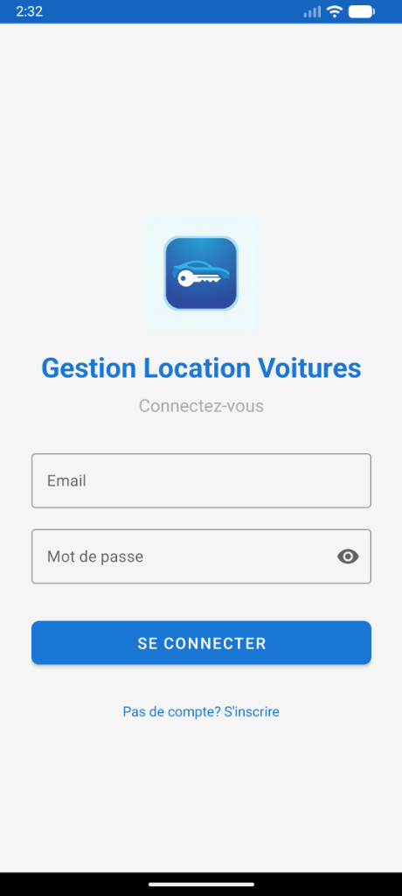
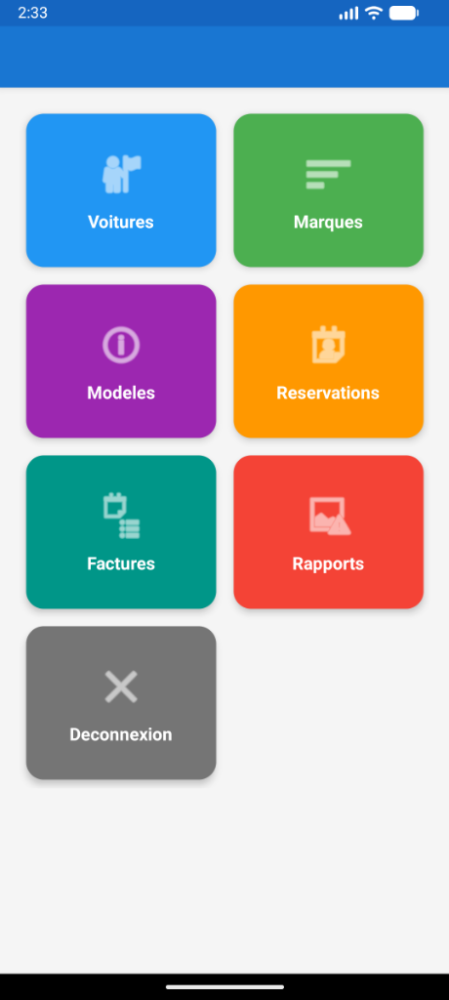
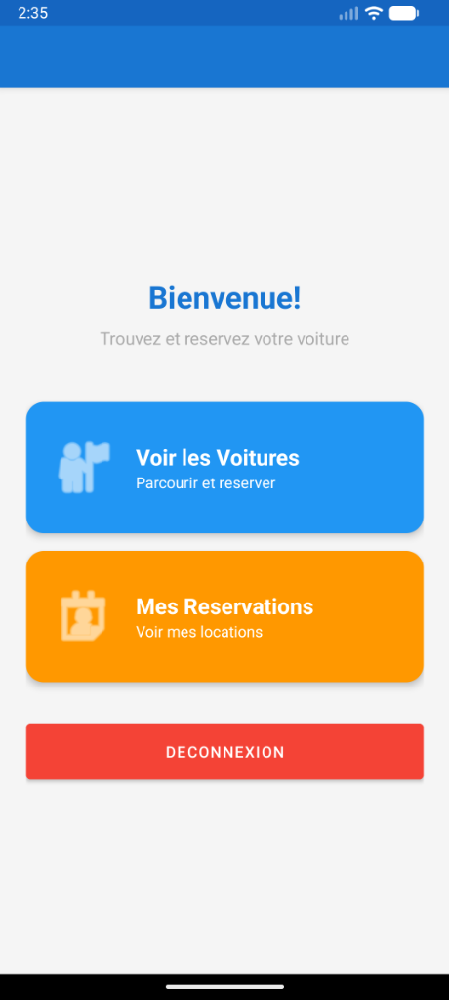

# 🚗 GestionVoitures - Application de Location de Voitures

Application Android de gestion de location de voitures développée avec Java et Firebase.

## 📱 Fonctionnalités

### Pour les Clients
- Inscription et Connexion sécurisées via Firebase Authentication
- Consultation des voitures disponibles avec images et détails
- **Recherche rapide** avec AutoComplete (par marque ou modèle)
- Réservation de voitures avec sélection des dates
- Suivi des réservations (en attente, confirmée, terminée)
- Consultation des factures

### Pour les Administrateurs
- Gestion des marques (CRUD complet)
- Gestion des modèles (CRUD complet avec liaison aux marques)
- Gestion des voitures (ajout, modification, suppression)
- Gestion des réservations (confirmation, annulation)
- Génération de factures
- Tableau de bord avec statistiques

## 🛠️ Technologies Utilisées

- Langage : Java
- IDE : Android Studio
- Base de données : Firebase Realtime Database
- Authentification : Firebase Authentication
- Stockage : Firebase Storage (pour les images)
- Architecture : MVC (Model-View-Controller)

## 📂 Structure du Projet

```
app/src/main/java/com/example/gestionvoitures/
├── model/
│   ├── Voiture.java
│   ├── Marque.java
│   ├── Modele.java
│   ├── Reservation.java
│   ├── Facture.java
│   └── Utilisateur.java
├── adapter/
│   ├── VoitureAdapter.java
│   ├── ClientVoitureAdapter.java
│   ├── MarqueAdapter.java
│   ├── ModeleAdapter.java
│   ├── ReservationAdapter.java
│   └── FactureAdapter.java
├── LoginActivity.java
├── RegisterActivity.java
├── MainActivity.java (Admin Dashboard)
├── ClientDashboardActivity.java
├── ClientVoituresActivity.java
├── VoitureListActivity.java
├── VoitureFormActivity.java
├── MarqueListActivity.java
├── ModeleListActivity.java
├── ReservationListActivity.java
└── FactureListActivity.java
```

## 🚀 Installation

1. Cloner le repository
   ```bash
   git clone https://github.com/walajl/LocationVoituresMobile.git
   ```

2. Ouvrir dans Android Studio
   - File > Open > Sélectionner le dossier du projet

3. Configurer Firebase
   - Créer un projet Firebase sur [console.firebase.google.com](https://console.firebase.google.com)
   - Télécharger `google-services.json`
   - Placer le fichier dans `app/`
   - Activer Authentication (Email/Password)
   - Activer Realtime Database

4. Compiler et exécuter
   ```bash
   ./gradlew assembleDebug
   ```

## 📸 Captures d'écran

| Connexion | Dashboard Admin | Dashboard Client |
|:---------:|:---------------:|:----------------:|
|  |  |  |

## 👥 Auteur

- Walaeddine Jlassi - Développeur

## 📄 Licence

Ce projet est sous licence MIT - voir le fichier LICENSE pour plus de détails.
